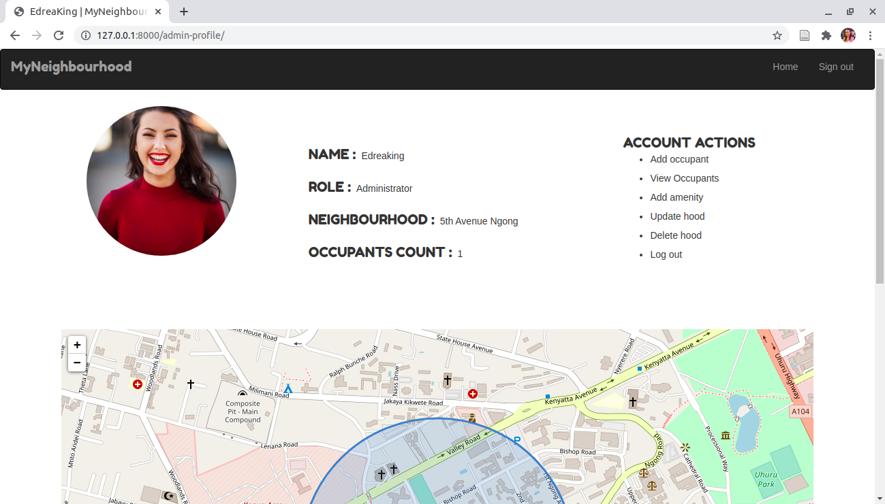

# MyNeighbourhood
#### MyNeighbourhood - a neighbourhood mapping application , 22/07/2020.
#### By Lorna Kamau

## Description
MyNeighbourhood is a neighbourhood app tailored for a specific neighbourhood. Users may take on either of the two user roles, i.e occupant or administrator. The roles of the administrator involve: adding occupants, adding amenities and general oversight of neighbourhood activities. An occupant is able to make a post visible to the neighbourhood and also add a business they think would interest other occupants.

## Live link
Visit the application on https://lorna-myneighbourhood.herokuapp.com/ .

## Development
To make advancements/modifications, follow these steps:

- Fork the repository
- Create a new branch (`git checkout -b improve-feature`)
- Make the appropriate changes in the files
- Add changes made
- Commit your changes (`git commit -am 'Improve feature'`)
- Push to the branch (`git push origin improve-feature`)
- Create a Pull Request 

## Setup & Run instructions
- Create and activate a virtual environment
- Install the dependencies listed in the `requirements.txt`
- Create a `.env` file. This will contain environment variables as listed in the `.env.sample` file.
- Finally, run your app on `MODE='dev'` config for debugging purposes

## Technologies Used
Technologies used to develop this application:

1. Python v3.6
2. Django 3.0.7
3. Javascript
4. Cloudinary
5. Bootstrap
6. HTML 
7. CSS

## Support and contact details

Should you be unable to access the website, have any recommendations and/or questions, feel free to email me:[kamaulorna@gmail.com](mailto:kamaulorna@gmail.com)

## [License](https://github.com/lornakamau/neighbourhood/blob/master/LICENSE.md)

Copyright (c) 2020 [Lorna Kamau](https://github.com/lornakamau)  